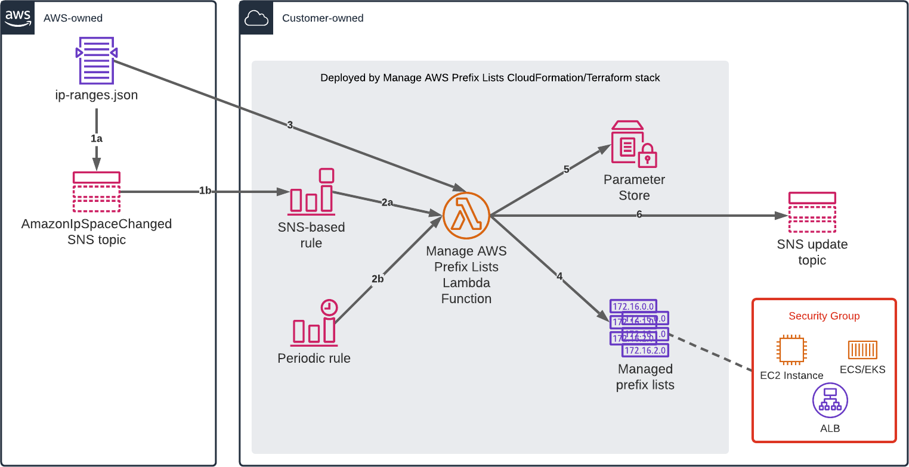

# Manage AWS Prefix Lists
This is a tool for automatically keeping one or more AWS prefix lists in sync with [`ip-ranges.json`](https://docs.aws.amazon.com/general/latest/gr/aws-ip-ranges.html).
This allows you to create security group rules that allow traffic from a specific AWS service or region without having to specify those ranges manually.


## Architecture


The central piece of this is a Lambda function that manages the prefix lists.

The Lambda function is invoked whenever:
* (1a) AWS updates the `ip-ranges.json` document, triggering a (1b) notification to an AWS-managed SNS topic that we subscribe to.
  This causes an (2a) AWS Event Bridge rule to invoke the Lambda function.
* (2b) A time-based AWS Event Bridge rule (e.g., daily, every 4 hours, etc.) fires and invokes the Lambda function.

When the Lambda function runs, it:
* (3) Reads `ip-ranges.json`,
* (4) Creates or updates a set of prefix lists in your account
* (5) Optionally updates AWS Systems Manager parameters with the prefix lists, and
* (6) Optionally notifies an AWS Simple Notification Service (SNS) topic when changes are made.

## Examples

Allowing security group access for CloudFront would look like the following:

### CloudFormation
CloudFormation requires some way of setting the prefix list ids. We assume that the prefix list ids have been saved to AWS Systems
Manager Parameter Store under the names `/ManagedPrefixLists/CloudFront/IPv4` and `/ManagedPrefixLists/CloudFront/IPv6`.

```yaml
VpcId:
  Type: AWS::EC2::VPC::Id
  Description: The VPC to create the security groups in.
CloudFrontPrefixListsIpv4:
  Type: AWS::SSM::Parameter::Value<List<String>>
  Description: The AWS SSM parameter holding the prefix list IDs for CloudFront's IPv4 ranges.
  Default: /ManagedPrefixLists/CloudFront/IPv4
CloudFrontPrefixListsIpv4:
  Type: AWS::SSM::Parameter::Value<List<String>>
  Description: The AWS SSM parameter holding the prefix list IDs for CloudFront's IPv6 ranges.
  Default: /ManagedPrefixLists/CloudFront/IPv6
Resources:
  # Ideally you should have a CloudFormation macro here that expands into the required number of security groups instead of
  # hard-coding the number directly. This is an advanced CloudFormation setup.
  AllowCloudFront0:
    Type: AWS::EC2::SecurityGroup
    Properties:
      GroupName: CloudFront-HTTPS (Group 0)
      GroupDescription: Allow CloudFront to access HTTPS ports
      VpcId: ...
      SecurityGroupIngress:
        - IpProtocol: tcp
          FromPort: 443
          ToPort: 443
          SourcePrefixListId: !Select [0, !Ref CloudFrontPrefixListsIpv4]
        - IpProtocol: tcp
          FromPort: 443
          ToPort: 443
          SourcePrefixListId: !Select [0, !Ref CloudFrontPrefixListsIpv6]
  AllowCloudFront1:
    Type: AWS::EC2::SecurityGroup
    Properties:
      GroupName: CloudFront-HTTPS (Group 1)
      GroupDescription: Allow CloudFront to access HTTPS ports
      VpcId: ...
      SecurityGroupIngress:
        - IpProtocol: tcp
          FromPort: 443
          ToPort: 443
          SourcePrefixListId: !Select [1, !Ref CloudFrontPrefixListsIpv4]
```

### Terraform
As of this writing, Terraform's [`aws_prefix_list` data source](https://registry.terraform.io/providers/hashicorp/aws/latest/docs/data-sources/prefix_list)
cannot query customer-managed prefix lists properly. Here, we assume that the prefix list ids have been saved to AWS Systems
Manager Parameter Store under the names `/ManagedPrefixLists/CloudFront/IPv4` and `/ManagedPrefixLists/CloudFront/IPv6`.

```terraform
variable "aws_vpc_id" {
    type = string
    description = "The VPC to create the security groups in."
}

variable "prefix_list_ssm_parameter_ipv4" {
    type = string
    description = "The AWS SSM parameter holding the prefix list IDs for CloudFront's IPv4 ranges."
    default = "/ManagedPrefixLists/CloudFront/IPv4"
}

variable "prefix_list_ssm_parameter_ipv4" {
    type = string
    description = "The AWS SSM parameter holding the prefix list IDs for CloudFront's IPv6 ranges."
    default = "/ManagedPrefixLists/CloudFront/IPv6"
}

data "aws_ssm_parameter" "prefix_list_ipv4" {
    name = var.prefix_list_ssm_parameter.ipv4
}

data "aws_ssm_parameter" "prefix_list_ipv6" {
    name = var.prefix_list_ssm_parameter.ipv6
}

resource "aws_security_group" "cloudfront" {
    # Create as many groups as needed according to the number of prefix lists seen.
    count = max(length(data.aws_ssm_parameter.prefix_list.ipv4.value, data.aws_ssm_parameter.prefix_list.ipv6.value))
    name = "CloudFrfront-HTTPS (Group ${count.index})"
    description = "Allow CloudFront to access HTTPS ports"
    vpc_id = var.aws_vpc_id
}

resource "aws_security_group_rule" "cloudfront_ipv4" {
    count = length(data.aws_ssm_parameter.prefix_list.ipv4.value)
    security_group_id = aws_security_group.cloudfront[count.index].id
    type = "ingress"
    protocol = "tcp"
    from_port = 443
    to_port = 443
    prefix_list_ids = [data.aws.ssm_parameter.prefix_list_ipv4.value[count.index]]
}

resource "aws_security_group_rule" "cloudfront_ipv6" {
    count = length(data.aws_ssm_parameter.prefix_list.ipv6.value)
    security_group_id = aws_security_group.cloudfront[count.index].id
    type = "ingress"
    protocol = "tcp"
    from_port = 443
    to_port = 443
    prefix_list_ids = [data.aws.ssm_parameter.prefix_list_ipv6.value[count.index]]
}
```


## Caution!
Security groups have a default limit of 60 IP rules per group -- this [cannot be increased without consequences](https://docs.aws.amazon.com/vpc/latest/userguide/amazon-vpc-limits.html#vpc-limits-security-groups).

Each customer-managed prefix list has a "maximum number of entries" setting. If you assign a customer-managed prefix list to a
security group, the value of this setting counts against your limit for that security group. _The actual number of CIDR blocks in
the prefix list is irrelevant here._

By default, this tool splits the security group into 